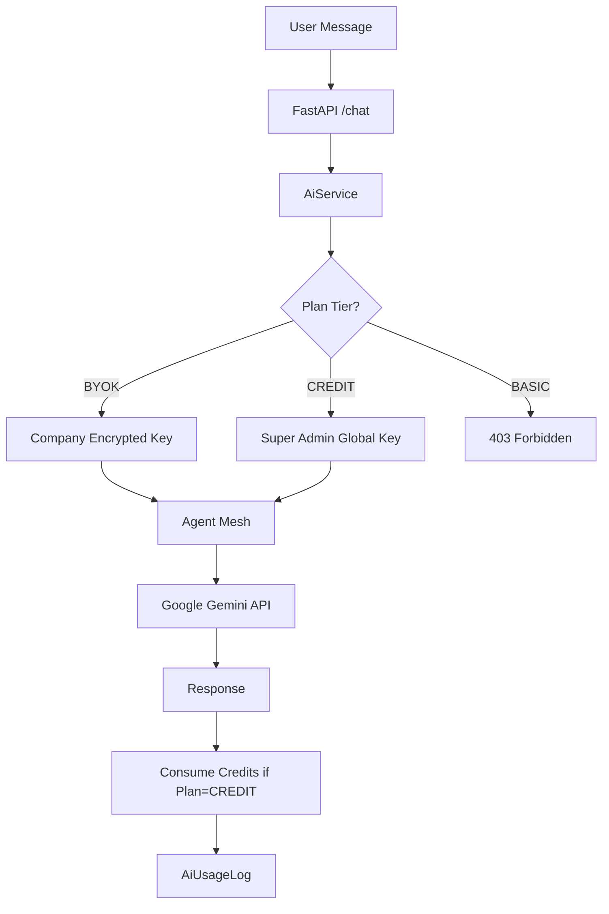

# Walkthrough - AI Subscription & Quota System

I have successfully implemented a robust, secure, and flexible AI Subscription system. This system allows for tenant-level plan selection, multi-tier API key management, and credit-based usage tracking.

## System Architecture

The following diagram illustrates the API Key Hierarchy and Request Flow:



## Key Components

### 1. Dynamic API Key Hierarchy
We moved away from hardcoded `.env` keys. The system now resolves the key in this order:
1. **Company BYOK Key**: Encrypted in the DB (AES-256).
2. **Super Admin Global Key**: Managed via the Admin Console.
3. **Environment Fallback**: For legacy support and development.

### 2. Request-Scoped Key Propagation
Using `contextvars`, the resolved API key is automatically propagated through the entire Agent Mesh without passing it through every function signature.

### 3. Credit Management
- **Credit Plan**: Interactions cost $0.05.
- **Auto-Blocking**: The system raises `402 Payment Required` when credits are zero.
- **Usage Logging**: Every interaction is logged for audit and billing.

## UI Enhancements

````carousel
### AI Subscription Settings
This component allows company admins to switch between plans and manage their BYOK keys.
<!-- slide -->
### Super Admin AI Config
A centralized panel for the SaaS owner to manage global API keys that power the Credit Plan.
<!-- slide -->
### Credit Limit Modal
A user-facing modal that automatically appears when AI credits are depleted, prompting for a top-up.
````

## Testing Utilities (Dev Only)

To facilitate testing, I've added a seeding endpoint and a dev-only top-up feature.

### 1. Pre-configured Test Users
Run `POST /api/v1/dev/seed-ai-test-users` to create the following accounts (Password: `Test123!`):

| User Email | Plan Tier | Initial State |
|---|---|---|
| `ai_basic@demo.com` | BASIC | AI Disabled |
| `ai_byok@demo.com` | BYOK | Uses Custom Keys |
| `ai_credit_full@demo.com` | CREDIT | $50.00 Balance |
| `ai_credit_empty@demo.com` | CREDIT | $0.00 Balance (Modal test) |

### 2. Dev Top-up
In the **Settings > AI Subscription** section, you will now see a **Dev: Top up $10** button. This allows you to instantly add credits to your test account without interacting with a payment gateway.

## Verification Checklist

- [x] **Tenant Isolation**: Keys are encrypted and scoped to the company ID.
- [x] **Zero Downtime**: Super Admin can update global keys without restarting services.
- [x] **UI Integration**: New "AI Subscription" section added to the main Settings page.
- [x] **Graceful Failure**: Credit exhaustion triggers a helpful top-up modal.

## Modified Files

- **Backend**:
  - [AiService](file:///c:/Users/user/Desktop/Insurance%20SaaS/backend/app/services/ai_service.py)
  - [Subscription API](file:///c:/Users/user/Desktop/Insurance%20SaaS/backend/app/api/v1/endpoints/subscription.py)
  - [System Models](file:///c:/Users/user/Desktop/Insurance%20SaaS/backend/app/models/system_settings.py)
- **Frontend**:
  - [AI Settings Component](file:///c:/Users/user/Desktop/Insurance%20SaaS/frontend/components/settings/ai-subscription-settings.tsx)
  - [Super Admin Panel](file:///c:/Users/user/Desktop/Insurance%20SaaS/frontend/components/admin/super-admin-ai-settings.tsx)
  - [Credit Limit Modal](file:///c:/Users/user/Desktop/Insurance%20SaaS/frontend/components/ai-agent/credit-limit-modal.tsx)
