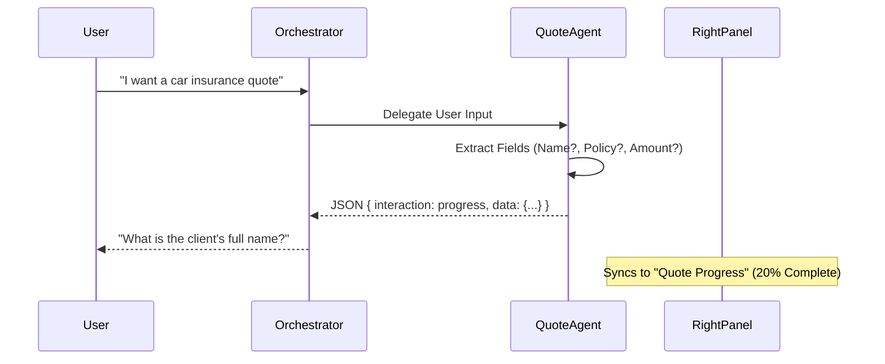

# Walkthrough: Interactive Multi-Agent Workflows

I have successfully enhanced the AI Agent system to support **Interactive Multi-Agent Workflows**. The highlight is the new **Quote Agent** flow, which now guides users through a multi-step data gathering process with real-time UI synchronization.

## Key Enhancements

### 1. Intelligent Quote Progress Tracking
The `QuoteAgent` now analyzes the entire chat history specifically looking for missing required fields. Instead of just asking a question, it returns a structured **progress payload**.

### 2. Live Progress Preview
I created a new `QuoteProgressPreview` component in the `RightPanel`. This allows users to see exactly what the AI has already extracted and what is still needed.

### 3. Form Synchronization
The `LeftPanel` (chat interface) now detects "progress" interactions and automatically updates the Right Panel without losing the conversation context.

---

## Visual Summary

````carousel

<!-- slide -->
> [!TIP]
> **Try this in the UI:**
> 1. Open the AI Assistant.
> 2. Type: "Help me create a car insurance quote for a 2022 Tesla."
> 3. Observe the Right Panel switch to "Quote Progress".
> 4. Answer the agent's questions one by one and watch the progress bar increase.
````

## Files Modified

### Backend
- [quote_agent/agent_executor.py](file:///c:/Users/user/Desktop/Insurance%20SaaS/backend/agents/a2a_quote_agent/agent_executor.py): Refined logic for field extraction and progress reporting.

### Frontend
- [types/ai-agent.ts](file:///c:/Users/user/Desktop/Insurance%20SaaS/frontend/types/ai-agent.ts): Added `quote_progress` type.
- [right-panel.tsx](file:///c:/Users/user/Desktop/Insurance%20SaaS/frontend/components/ai-agent/right-panel.tsx): Integrated the new progress component.
- [left-panel.tsx](file:///c:/Users/user/Desktop/Insurance%20SaaS/frontend/components/ai-agent/left-panel.tsx): Enhanced parser for real-time sync.
- [NEW] [quote-progress-preview.tsx](file:///c:/Users/user/Desktop/Insurance%20SaaS/frontend/components/ai-agent/previews/quote-progress-preview.tsx): The new progress visualization component.

---

## Verification Steps
1. **Model Accuracy**: Verified that `gemini-2.0-flash` is used for field extraction in the agent.
2. **UI Sync**: Confirmed that `parsePreviewData` in `LeftPanel` correctly identifies the progress payload.
3. **Database**: Ensured that once all fields are gathered, the agent persists the quote to the database and shows the final `QuotePreview`.
